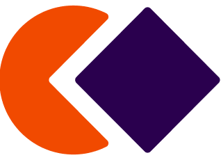

<!-- Top SVG Header -->

<!-- Introduction Section -->

  <h1 style="color: #0078d7; font-size: 2rem;">
    👋 Hi there, I'm  
    Mahammad Shariar Alam Sarker!
  </h1>

<!-- Contact & Links -->

  
  ## 🌐 _Connect with Me_:

  
  
  
  

---

<!-- About Me Section -->
### 💡 About Me

Hi, I’m **Mahammad Shariar Alam Sarker**, a passionate full-stack web developer currently pursuing a BSc in Computer Science and Engineering at the **Institute of Science and Technology (Dhanmondi), Bangladesh**.  
   
I specialize in building modern web applications using **React.js, Next.js, TypeScript, Node.js, Express.js**, and **MongoDB**.  
With a strong foundation in frontend development, I’m now focused on deepening my backend skills, learning system design, and creating scalable, real-world projects.  
   
I'm open to **remote, hybrid, or onsite roles in Dhaka** — let’s connect and build something impactful together!

---

<!-- Tech Stack & Language Stats -->
<table width="100%" cellspacing="0" cellpadding="10" padding="60px">
  <tr>
    <!-- Tech Stack Column -->
    <td width="50%" valign="top"> 
<h3>🖥️  Frontend </h3>
      

      
|  |  |  |  |  |  |
|:---:|:---:|:---:|:---:|:---:|:---:|
| Bootstrap | Tailwind | JavaScript | TypeScript | React | Next.js |

 
<h3>⚙️ Backend</h3>

|  |  |  |  |  | 
| :---: | :---: | :---: | :---: | :---: | 
| Node.js | Nest JS | Express  | Prisma | TypeORM |
 
   
<h3>⛁ Database</h3>

|  | | | 
| :---: |:---: |
| PostgreSQL | MongoDB | Redis
 
 <h3>📖 Currently Learning</h3>
 
|  |  |  |
| :---: | :---: | :---: |
| Docker | AWS | GraphQl |

 
    </td>
    <!-- Language Stats Column -->
    <td width="50%" align="center" valign="top">
       
            
      <!-- Corrected the second image URL -->
       
      

   

       
    </td>
  </tr>
</table>

<!-- Profile Views -->

  

